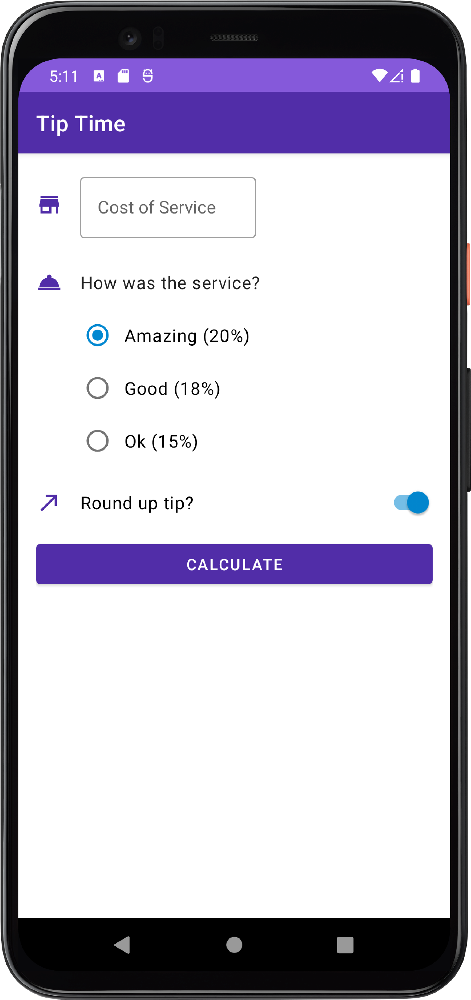
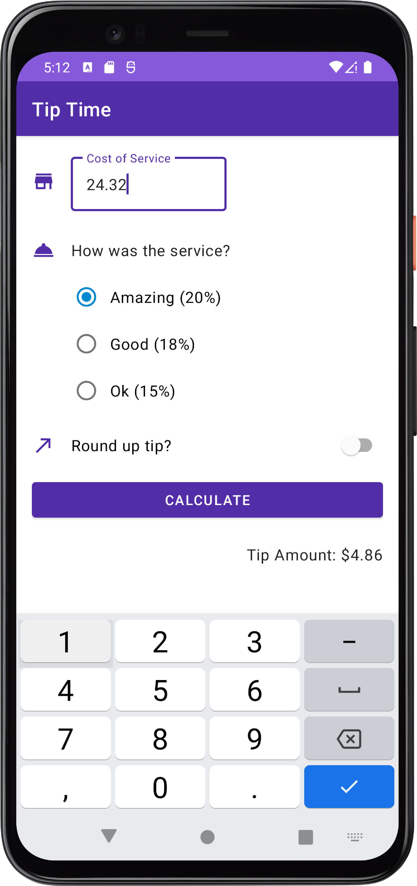

# Tip Time

<p>
  
  
</p>

## About the Project

Tip Time is a Kotlin app that helps users calculate the tip amount for a bill based on the selected tip percentage and the number of people to split the bill. It provides a user-friendly interface to input the bill amount, choose the desired tip percentage, and split the bill among multiple people.

## Features

- Tip Calculation: Calculate the tip amount based on the bill and selected tip percentage.
- Easy-to-Use Interface: A simple and intuitive user interface for a smooth user experience.

## Installation

1. Clone this repository or download it as a zip file:
```
git clone https://github.com/denaktepe/tip-time.git
```
2. Open the project in Android Studio.

3. Build and run the app on an emulator or a physical device.

## How to Use

1. Enter the bill amount in the provided field.

2. Use the slider to select the desired tip percentage.

4. The app will automatically calculate and display the tip.

## Contributing

If you'd like to contribute to this project, please follow these steps:

1. Fork this repository to your GitHub account.

2. Create a new branch: `git checkout -b my-feature`

3. Make your changes and commit them: `git commit -m "Add a new feature"`

4. Push your changes: `git push origin my-feature`

5. Open a pull request and share your changes.

## Contact

For any questions, suggestions, or feedback, please email me at sametcagriaktepe.com.


